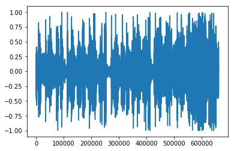
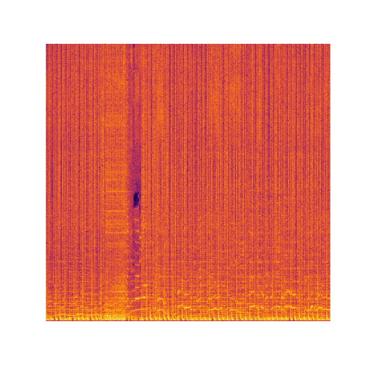
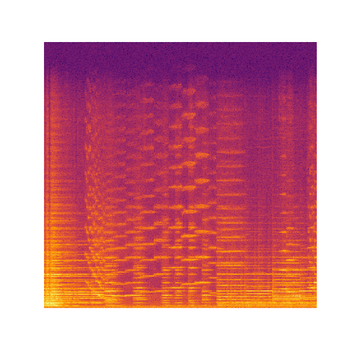

# Music Genre Classification
## Beginning
This project started as a mini team project with an aim to learn different machine learning models. The initial problem statement was to classify music into any two categories. Different features like tempo, beats, stft, mfccs, etc were extracted using <a href='https://librosa.github.io/'>Librosa</a> from the <a href='http://marsyasweb.appspot.com/download/data_sets/'>GTZAN Genre Collection</a> dataset. On that data we implemented logistic regression and neural network from scratch independent of any framework.  
The repository for this task is <a href='https://github.com/Insiyaa/Music-Tagging'>here</a>.

## What next?
After this project, I went on learning more about computer vision and deep learning. Reading more and more about it, I started thinking if I could apply CNNs on the music data. Also I hoped that transfer learning would help me attain accuracy closer to the <a href='https://musicinformationretrieval.wordpress.com/2017/02/06/state-of-the-art-audio-tag-classification-genre/'>State of the art models</a> on GTZAN dataset.

## Representing Music as Image
A very naive idea of mine was to simply plot the y values as shown below.  
  
By soon I realized that it won't just work as it doesn't give much information about tones. While going through different articles for visualizing music, I came across this [paper]('cs231n.stanford.edu/reports/2017/pdfs/22.pdf') (luckily having the same idea as mine) and decided to go for melspectograms.  
A spectrogram is a visual representation of the spectrum of frequencies of sound or other signal as they vary with time. Spectograms allow looking at the whole song once and get the information about the tones present right away!  
  
These looked quite promising to me and so created a dataset using <a href='https://github.com/Insiyaa/Music-Genre-Classification/blob/master/create_dataset.ipynb'>this</a> notebook.

## Transfer Learning
While exploring more and more about deep learning, I came across PyTorch and decided to use it. But later on I started with <a href='https://course-v3.fast.ai/'>Practical Deep Learning for Coders, v3</a> and decided to use fastai library which is easier to use, intuitive, reliable and build on the top of PyTorch.  
I used the pretrained models of ResNet34 and ResNet50 as feature extractors using Google Colab GPU.  
ResNet34 has the accuracy of 75.6%  
ResNet50 has the accuracy of 80.3%  
The accuracy are pretty much comparable with the <a href='https://musicinformationretrieval.wordpress.com/2017/02/06/state-of-the-art-audio-tag-classification-genre/'>State of the art models</a>.  

